#  Module 5.2 - Developing and Hosting OGC Services - OGC Services and Styling in GeoServer - Part II #

### Overview ###

* Review of Raster Styling  in GeoServer

* Raster Styling Demonstration

### Raster Symbolizer - Review ###

~~~~~~~~~~ {#rasterSymbolizerElements .xml }
<Opacity>
<ColorMap type=ramp|values|intervals extended=true|false>
  <ColorMapEntry color="" quantity="" label="" opacity=""/>
<ChannelSelection>
  <RedChannel> <GreenChannel> <BlueChannel>
	<SourceChannelName>
  <GrayChannel>
	<SourceChannelName>
<ContrastEnhancement>
<ShadedRelief> (not implemented in ver 2.0)
<OverlapBehavior> (not implemented in ver 2.0)
<ImageOutline> (not implemented in ver 2.0)
~~~~~~~~~~

### Sample Raster SLD for Color Map Examples ###

~~~~~~~~~~ {#simpleRasterSymbolizer .xml }
<NamedLayer>
  <Name>gtopo</Name>
  <UserStyle>
    <Name>dem</Name>
    <Title>Simple DEM style</Title>
    <Abstract>Classic elevation color progression</Abstract>
    <FeatureTypeStyle>
      <Rule>
        <RasterSymbolizer>
          <Opacity>1.0</Opacity>
          <ColorMap>
            <ColorMapEntry color="#000000" quantity="-500" label="nodata" opacity="0.0" />
            <ColorMapEntry color="#AAFFAA" quantity="0" label="0" />
            <ColorMapEntry color="#00FF00" quantity="1000" label="1000"/>
            <ColorMapEntry color="#FFFF00" quantity="1200" label="1200" />
            <ColorMapEntry color="#FF7F00" quantity="1400" label="1400" />
            <ColorMapEntry color="#BF7F3F" quantity="1600" label="1600" />
            <ColorMapEntry color="#99CC66" quantity="2000" label="2000" />
            <ColorMapEntry color="#336633" quantity="2500" label="2500" />
            <ColorMapEntry color="#006600" quantity="3000" label="3000" />
            <ColorMapEntry color="#FFFFFF" quantity="3500" label="3500" />
          </ColorMap>
        </RasterSymbolizer>
      </Rule>
    </FeatureTypeStyle>
  </UserStyle>
</NamedLayer>
~~~~~~~~~~

### Default "Ramp" Raster Color Map ###

	<ColorMap> or <ColorMap type="ramp">

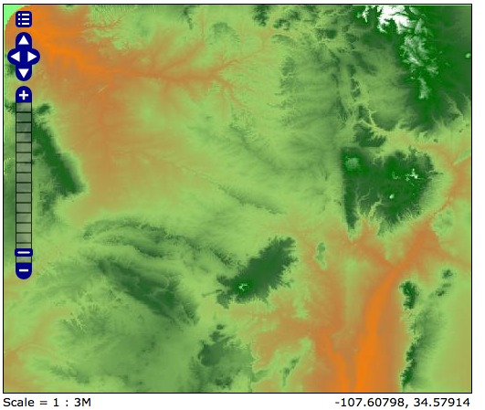\ 

### "intervals" Raster Color Map ###

	<ColorMap type="intervals">

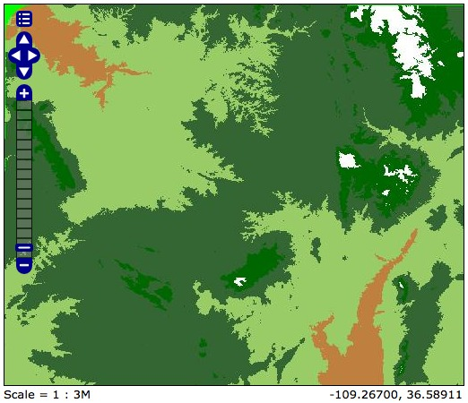\ 

### "values" Raster Color Map ###

	<ColorMap type="values">

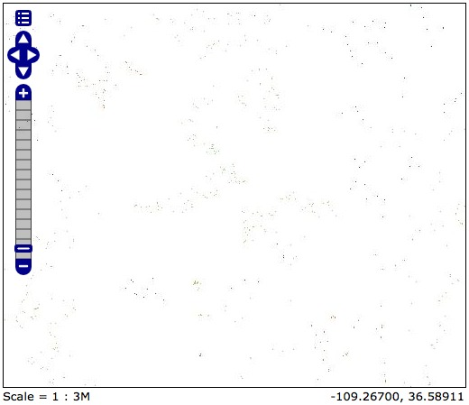\ 

### Legend Graphics for the Three Styes ###

~~~~~~~~~~ {#getLegendGraphicRequest}
http://geog485.unm.edu:8080/geoserver/wms?
  service=WMS&
  version=1.1.0&
  request=GetLegendGraphic&
  layer=Karl:kb_nm_ned09_30m_nw_qtr2&
  style=dem-value&
  format=image/png
~~~~~~~~~~

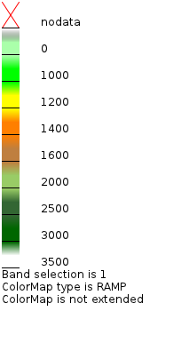\ 
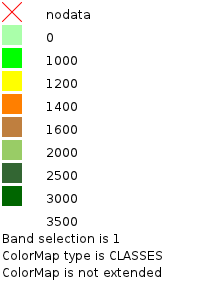\ 
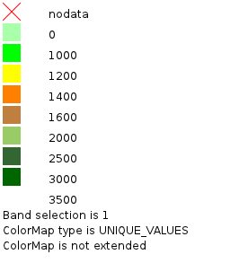\ 

[GeoServer GetLegendGraphic Documentation](http://docs.geoserver.org/stable/en/user/services/wms/get_legend_graphic/legendgraphic.html)

### Extend or Not To Extend? ###

~~~~~~~~~~ {#extendedRamp .xml }
<ColorMap type="ramp" extended="false">  = 256 colors in ramp 
<ColorMap type="ramp" extended="true"> = 65536 colors in ramp
~~~~~~~~~~

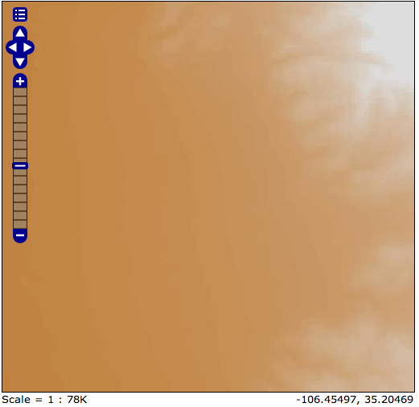\ 
\ 

### Opacity ###

Options for defining `opacity` appear in two places in the _raster symbolizer_. 

At the level of the entire raster dataset

~~~~~~~~~~ {#opacityRasterSymbolizerElement .xml }
<Opacity>0.5</Opacity>
~~~~~~~~~~

Within a `ColorMapEntry` for a specific color definition within a `ColorMap`

~~~~~~~~~~ {#opacityColorMapEntry .xml }
<ColorMap>
   <ColorMapEntry color="#000000" quantity="-500" label="nodata" opacity="0.0" />
   <ColorMapEntry color="#AAFFAA" quantity="0" label="0" />
   <ColorMapEntry color="#00FF00" quantity="1000" label="1000"/>
   ...
   <ColorMapEntry color="#FFFFFF" quantity="3500" label="3500" />
</ColorMap>
~~~~~~~~~~

### Channel Selection ###

Many raster datasets contain multiple _bands_ of values which may be viewed individually or assigned to the colors _red_, _green_, and _blue_ to generate a color image representing a combination of band values. GeoServer allows for the specification of a single band for display as a `GrayChannel` or three bands as `RedChannel`, `GreenChannel`, and `BlueChannel`. 

~~~~~~~~~~ {#channelSelection .xml }
<RasterSymbolizer>
 <Opacity>1.0</Opacity>
 <ChannelSelection>
  <RedChannel>
	<SourceChannelName>3</SourceChannelName>
  </RedChannel>
  <GreenChannel>
	<SourceChannelName>2</SourceChannelName>
  </GreenChannel>
  <BlueChannel>
	<SourceChannelName>1</SourceChannelName>
  </BlueChannel>
 </ChannelSelection>
</RasterSymbolizer>
~~~~~~~~~~

### Channel Selection - illustration ###

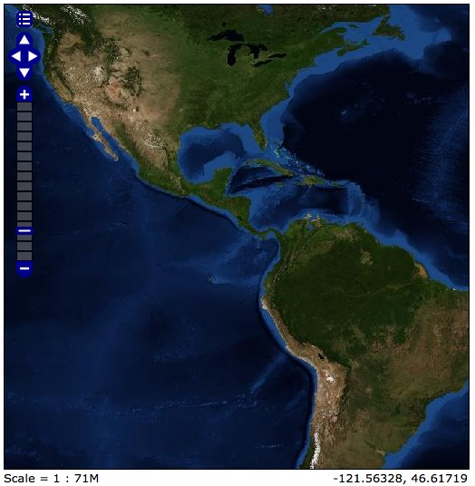\ 
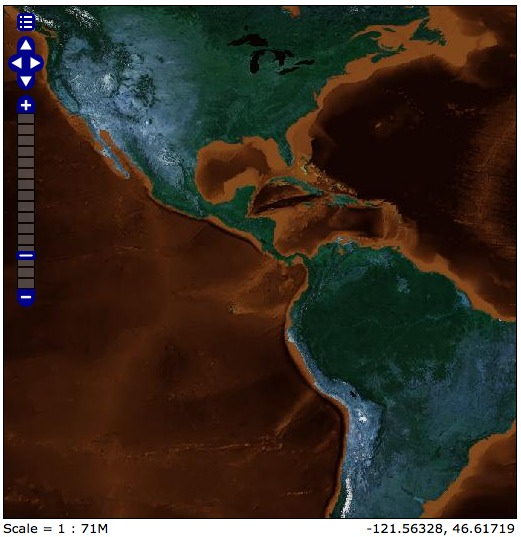\ 

### Contrast Enhancement ###

Some raster data may need adjustment to increase the contrast (the range between the darkest and lightest values) displayed. GeoServer provides three options for contrast enhancement, each of which have a different effect on the resulting image.

Histogram
:	The values are stretched so that an equal number of pixels fall into each color in the range

Normalize
:	The minimum and maximum brightness values are mapped to the minimum and maximum raster values

Gamma
:	The image is brightened or darkened by a specified factor (negative numbers darken, positive numbers brighten)

### Sample Contrast Enhancement SLD for Examples ###

~~~~~~~~~~ {#contrastEnhancement .xml }
<RasterSymbolizer>
  <Opacity>1.0</Opacity>
  <ChannelSelection>
    <RedChannel>
      <SourceChannelName>1</SourceChannelName>
      <ContrastEnhancement>
      <Histogram/>
      </ContrastEnhancement>
    </RedChannel>
    <GreenChannel>
      <SourceChannelName>2</SourceChannelName>
      <ContrastEnhancement>
      <Histogram/>
      </ContrastEnhancement>
    </GreenChannel>
    <BlueChannel>
      <SourceChannelName>3</SourceChannelName>
      <ContrastEnhancement>
      <Histogram/>
      </ContrastEnhancement>
    </BlueChannel>
  </ChannelSelection>
</RasterSymbolizer>
~~~~~~~~~~

### Default - Normalize ###

~~~~~~~~~~ {#contrastEnhancementNormalize .xml }
<ContrastEnhancement>
  <Normalize/>
</ContrastEnhancement>
~~~~~~~~~~

\ 
\ 

### Default - Histogram ###

~~~~~~~~~~ {#contrastEnhancementHistogram .xml }
<ContrastEnhancement>
  <Histogram/>
</ContrastEnhancement>
~~~~~~~~~~

\ 
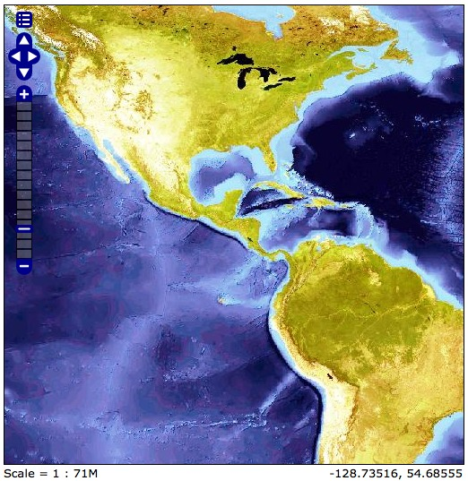\ 

### Default - Gamma  ###

~~~~~~~~~~ {#contrastEnhancementGamma .xml }
<ContrastEnhancement>
  <GammaValue>.5</GammaValue>
</ContrastEnhancement>
~~~~~~~~~~

\ 
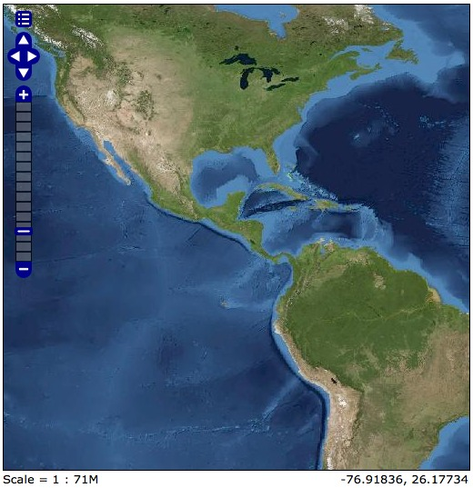\ 

### GeoServer Demo/Q&A ###

Class GeoServer Instance: [http://geog485.unm.edu:8080/geoserver/web/](http://geog485.unm.edu:8080/geoserver/web/)

